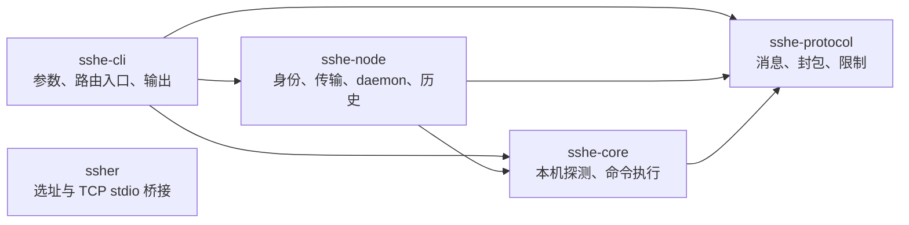
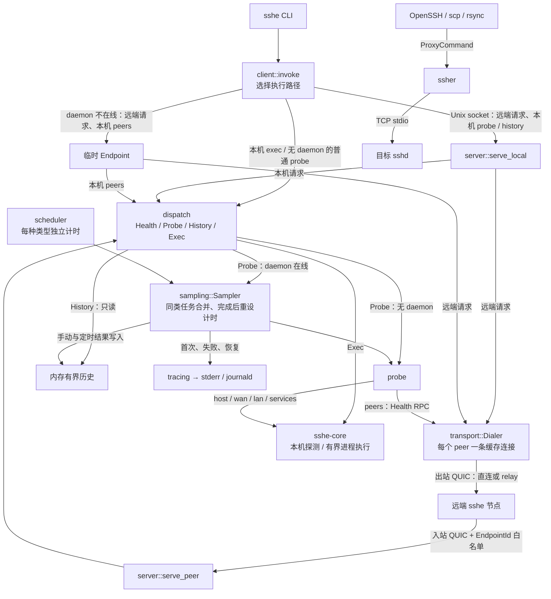

# sshe

Linux 上的对等节点诊断和非交互式应急控制工具。Iroh 提供加密连接、地址查找和 relay；sshe 提供即时与定时探测、历史记录与命令执行。`ssher` 保留为独立的 OpenSSH ProxyCommand 工具。

## Workspace

根 Cargo.toml 是 virtual workspace；依赖版本统一管理。

| crate | 职责 |
| --- | --- |
| sshe-protocol | RPC 类型、ALPN、有限长度的 JSON 封包 |
| sshe-core | 本地探测、有限时长和输出的命令执行 |
| sshe-node | 配置、持久身份、Iroh、白名单、Unix socket、定时探测与历史 |
| sshe-cli | `sshe` 命令解析与输出 |
| ssher | 保留的地址选择和 TCP stdio 桥接 |

各 crate 按职责拆分模块，`lib.rs` 负责模块声明和公开接口，`main.rs` 负责启动和退出处理：

- `sshe-cli`：`args` 定义命令（本地命令与可远程命令分为两个枚举），`app` 分派操作，`output` 格式化结果。
- `sshe-core`：`config`、`exec`、`error`、`time`；`probe/` 下分别实现 host、network、services 和公共测量逻辑。
- `sshe-node`：模块单向依赖，自底向上为 `transport`（Endpoint、RPC、超时）→ `probe` → `sampling`（同类采样合并、记录与计时）→ `dispatch`（在 `Node` 上执行单个请求）→ `server`（服务 peer 与本地请求）/ `client`（CLI 侧路由）→ `daemon`（生命周期与准入）。另有 `config`、`identity`（密钥与锁）、`layout`（由配置路径派生的文件）、`history`、`scheduler`、`ipc`、`error`；跨模块测试集中在 `tests.rs`；传输、采样和调度回归测试在对应模块目录的 `tests.rs`。对外只公开 `config`、`invoke`、`daemon`、`endpoint_id` 与错误类型。
- `sshe-protocol`：`message` 定义消息，`codec` 处理封包，`limits` 集中协议常量，`error` 定义错误。
- `ssher`：保留现有入口与错误类型，以及 `ssher/` 下的参数、配置、缓存和探测模块。

内部库使用 `thiserror`，二进制入口用 `anyhow` 添加上下文。

```bash
cargo build --workspace
cargo test --workspace
cargo clippy --workspace --all-targets -- -D warnings
cargo fmt --all -- --check
cargo install --path crates/sshe-cli
cargo install --path crates/ssher
```

## 架构

crate 依赖方向如下，箭头表示“依赖”；`ssher` 是独立二进制，不依赖 sshe 的节点协议。



下面是请求与数据流。`dispatch`、`probe` 和 `Dialer` 是库模块，既可由 daemon 使用，也可用于 CLI 进程中的直接调用或临时 Endpoint。



`daemon` 管理持久 Endpoint、Unix listener、身份锁、连接与请求配额，以及 scheduler 和服务任务的启动/退出。本机 history 必须有 daemon；daemon 内的手动与定时 probe 共用采样入口，写入同一份历史。`config`、`identity`、`layout` 提供配置、密钥和路径，`sshe-protocol` 统一 RPC 消息与封包。

## 初始化与信任

```bash
sshe init
sshe id
sshe peer add desktop <endpoint-id>
sshe peer list
sshe daemon
```

默认配置为 `$XDG_CONFIG_HOME/sshe/config.toml`，未设置 XDG 时使用 `~/.config/sshe/config.toml`。`--config PATH` 可指定独立实例。

`init` 创建权限 600 的 `config.key` 和配置；新建目录权限 700。密钥与配置放在同一目录，身份不会在重启时变化；已有配置不会被覆盖，损坏的密钥不会被自动替换。备份密钥即可保留身份，勿共享私钥。

`[peers]` 同时是本地通讯录与入站白名单。要让笔记本访问 VPS，VPS 配置中必须存在笔记本的 EndpointId。别名仅在本机解释，双方别名可以不同；协议和鉴权只使用 EndpointId。`self` 为 CLI 保留字，不能配置为 peer。白名单节点可执行节点进程权限范围内的所有命令。

peer 可额外配置已知直连地址，例如 VPS 的公网 IP，拨号时与地址查找并用，不完全依赖 n0 的地址查找服务；配合对端的 `daemon.bind_port` 固定 UDP 端口，便于放行防火墙：

```toml
[peers.vps]
id = "<endpoint-id>"
addrs = ["203.0.113.7:7777"]
```

修改配置或 peer 后重启 daemon 生效。`peer add` 不隐式覆盖已有别名。配置示例见 [example/sshe.toml](example/sshe.toml)。旧 `sshea/sshed` 及其 token 配置已退役。

## CLI

```bash
sshe probe host                     # 本机，等价于 @self probe host
sshe @desktop probe wan
sshe @desktop probe lan
sshe @desktop probe services
sshe probe peers                    # 本机此刻能否访问各 peer
sshe @vps probe peers               # VPS 此刻的视角
sshe history                        # 本机 daemon 记录的最近 50 条手动/定时结果
sshe history --kind peers --about desktop -n 10
sshe @vps history --kind wan        # VPS 记录的结果
sshe @desktop exec -- systemctl status easytier
sshe @desktop exec --timeout 10 -- ip route
sshe --json @desktop exec -- printf '%s' 'literal argument'
sshe peer remove desktop
```

命令分三类：

- `probe`：立即探测；若同类探测正在运行，则共享这一轮结果。daemon 在线时，完成后先写历史再返回，并将该类型的下一次自动探测安排在完成时间加 `daemon.interval_secs`；失败和超时同样记录。手动探测不在 `daemon.probes` 中的类型不会将其加入定时任务。不同类型并发执行，互不重置计时。
- `history`：读取 daemon 记录的手动与定时探测结果，从不发起探测；`--about` 精确匹配记录的目标或标签（如 peer 别名、服务名）。`@target` 选择查询哪个节点的历史，`--about` 在该节点的历史中过滤，因此别名按被查询节点的配置解释：`sshe @vps history --about desktop` 中的 `desktop` 是 VPS 上的别名，使用 EndpointId 则在任何节点上都一致。
- `exec`：执行一次命令。

`init`、`id`、`peer`、`daemon` 只在本机执行。节点间心跳使用内部 Health RPC（返回 EndpointId、状态与版本），CLI 不直接暴露。

探测与历史输出 JSON，每条记录包含类型、目标、标签、方法、采样时间、耗时、成功与否、错误、错误分类、最后成功时间，以及可选的结构化数据。错误分类 `error_kind` 取值：`timeout`、`no_address`（地址查找或 relay 不可用）、`refused`、`unreachable`、`unauthorized`（对方 `[peers]` 中没有本机）、`connection_lost`、`dns`、`remote`（对方应答了错误或不健康状态）、`other`。exec 默认将 stdout/stderr 原样写回对应输出流，并传播退出码；`--json` 输出字节数组及执行结果，保留非 UTF-8 数据。

本机所有 probe 和远端请求优先通过权限 600 的 Unix socket 交给 daemon。daemon 未运行时，本机 host/wan/lan/services 直接探测，peers 和远端请求使用临时 Endpoint；本机探测不保留历史或计时。`history` 需要被查询节点的 daemon 在线。本机 exec 仍直接调用 core。远端 probe 的历史与计时属于实际执行探测的节点，发起端只接收结果；内部 Health RPC 不触发采样，也不更新历史或计时。socket 路径为配置路径换扩展名，必须短于 108 字节：过长时 daemon 拒绝启动并说明原因，CLI 按上述规则直接探测或使用临时 Endpoint。身份文件旁的锁防止同一身份启动多个 Endpoint。socket 所在目录必须为当前用户私有（700）。

## 探测与执行边界

- host：hostname、uptime 秒数、1/5/15 分钟 loadavg、内存与 swap 字节数、根文件系统容量。
- WAN/LAN：配置域名的 DNS 解析，以及显式 `host:port` 的 TCP 连接；组内各项并发执行，单项超时为 `probe.timeout_secs`（默认 5 秒，上限 10 秒；可容忍两次 SYN 丢失），每组最多 16 项。DNS 结果附带解析出的地址。TCP 成功只表示建立连接，不验证应用协议。
- services：`tcp:host:port` 或 `systemd:unit`，systemd 检查使用 `systemctl is-active`。
- peers：并发对每个 peer 发起 Health RPC，单个 peer 最多 `probe.peer_timeout_secs`（默认 15 秒，含冷启动拨号）。这个上限刻意短于救援请求的 30 秒拨号上限：探测要回答“对方此刻是否及时可达”，过长的超时会把故障掩盖成一次很慢的成功。成功表示握手、对方 daemon 和对方白名单都正常；失败原因见 `error_kind`。
- 未实现 PMTU、ICMP 丢包统计或自动故障归因。
- daemon 启动后先等待连上 relay（最多 10 秒，断网时照常继续），随后分别调度 `daemon.probes` 中的类型（默认 wan 和 peers）：尚未采样的立即执行，之后每次完成（包括手动探测）再等待 `daemon.interval_secs` 秒（默认 60）。启动等待期间已完成的手动探测也会被计入。所有 daemon 内的探测结果写入内存中的有界历史：每个（类型、方法、目标）保留最近 `daemon.history_size` 条（默认 64），最后成功时间在旧记录被淘汰后仍保留。慢的一轮只推迟同类探测，不影响其他类型。历史在重启后清空；没有记录表示尚未采样，不表示目标离线。读取时用采样时间判断新鲜度。
- 持久记录交给 journald：daemon 只在状态变化时写日志（首次结果、`check failed`、`check recovered`，后者附带距上次成功的秒数，即故障持续时间的上限），形成紧凑的事件时间线，用 `journalctl --user -u sshe` 查看。在 journald 下日志不带自身时间戳和颜色。`RUST_LOG` 可覆盖日志级别，默认 daemon 为 `warn,sshe_node=info`，其他命令只输出 sshe 自身的警告。
- exec 使用程序和 argv，默认不经过 shell；stdin 关闭，无 PTY。默认超时 30 秒，上限 60 秒；stdout/stderr 各限 256 KiB。超时、输出溢出或任务取消会终止进程组。显式运行 shell 仍然可以，但不是默认行为。
- 命令发送后连接失败返回“结果未知”，不会自动重试。连接中断不会保证撤销已收到的命令；服务端仍受上述执行上限约束。daemon 退出时取消任务并清理子进程。
- 连接按需建立并复用：每个 peer 缓存一条出站连接，需要时才拨号，不在后台重连。iroh 每 5 秒保活，对端失联约 30 秒后连接关闭，下次请求重新拨号；复用的连接失效时，非 exec 请求及尚未提交的 exec 会在新连接上重试一次。每个 RPC 使用独立双向 QUIC stream，同一连接上的请求并发处理。等待 peer 拨号锁与实际拨号共享 30 秒预算；整次 RPC（含重试）共用 110 秒截止时间，本地 CLI 等待 daemon 的预算为 115 秒。单个 stream 被重置不会关闭共享连接，只有确认连接已经关闭才尝试安全重连；已提交的 exec 超时仍返回“结果未知”。
- 准入分三层：入站连接（含握手）最多 64 条，超出时拒绝握手；peer 请求与本地请求各自最多 `daemon.max_concurrent` 个（默认 16），超出时回复“daemon busy”且不执行，因此远端无法挤占本机管理通道。最大帧 4 MiB，单次 history 最多返回 1000 条。

Iroh 使用 N0 默认 relay 和地址查找配置。它提供独立于 EasyTier/sshd 的控制路径，但仍依赖底层网络及可用的寻址/relay 服务。本地 QUIC 测试不等同于跨 NAT、公共 relay 或真实故障环境验收。

示例 systemd user unit 见 [example/sshe.service](example/sshe.service)，需按实际安装路径修改 ExecStart 后自行启用。本仓库不会自动安装或启用服务。

## ssher

`ssher` 的职责很单一：

- 根据逻辑主机名选择当前最优 endpoint
- 建立到目标 `host:port` 的 TCP 连接
- 将本地 `stdin/stdout` 直接桥接到该 TCP 连接

`ssher` 不负责：

- 执行 `ssh`
- 处理 `user`
- 处理 `identity_file`
- 透传远端命令

这些都交给 OpenSSH 自己处理。

## ssh_config 接入

```sshconfig
Host my-pc
  User wsdlly02
  IdentityFile ~/.ssh/id_ed25519
  ProxyCommand /path/to/ssher --host %n --port %p
```

这样 `ssh`、`scp`、`rsync` 等工具都会通过 `ssher` 先选择地址，再继续使用现有 OpenSSH 工具链。
不要在 `ssh_config` 中为这类条目定义 `HostName`，让逻辑主机名直接作为 `ssher` 的配置键。

## 配置文件

默认会按顺序查找以下配置路径：

- `~/.ssh/ssher.toml`
- `~/.config/ssher.toml`
- `~/.config/sshe/ssher_config.toml`

示例配置见 [example/ssher.toml](example/ssher.toml)。

配置文件现在只保留“探测和选址”相关字段：

- `probe_timeout_ms`
- `cache_ttl_sec`
- `cache_path`
- `selection_mode`
- `endpoints`

## 使用方式

直接调试时可以这样运行：

```bash
cargo run --bin ssher -- --host my-pc --port 22
cargo run --bin ssher -- --host my-pc --port 22 --refresh-cache -v
```

`-v` 只会输出到 `stderr`，不会污染 `ProxyCommand` 的 `stdout` 数据流。  
`--refresh-cache` 会跳过缓存并强制重新测速，然后用最新结果覆盖缓存。

## 缓存

- 默认缓存路径：`/run/user/<uid>/sshe/ssher_cache.toml`
- 默认缓存 TTL：`300` 秒
- 可通过 `global.cache_path` 和 `global.cache_ttl_sec` 覆盖
- 只有在“缓存未过期、端口一致、选址模式一致、缓存地址仍在候选集”时才会命中

## 选择逻辑

- `lowest_tcp_latency`: 对所有 `endpoint:port` 全量并发建立 TCP 连接，首个成功完成的地址优先
- `lowest_icmp_latency`: 对所有 `endpoint` 全量并发调用 Linux `ping`，首个成功完成的地址优先

## 说明

- 当前版本只支持 Linux
- `lowest_icmp_latency` 依赖 Linux 风格的 `ping -c 1 -W <sec>`
